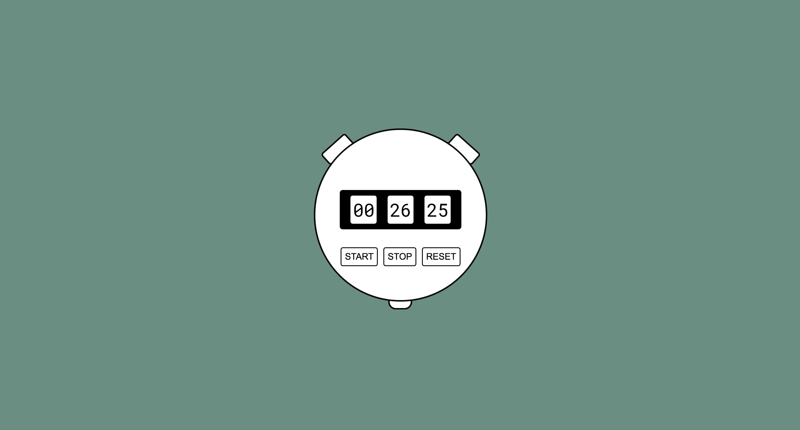

# Stop Watch ⏱
A simple Stop Watch

## Installation
1. Clone the repo\
git clone https://github.com/johannafryxell/StopWatch

2. Run parcel\
npm run build

## Built with
- HTML
- Sass
- TypeScript
- Parcel

## Details
This was a personal project I created to practice TypeScript
